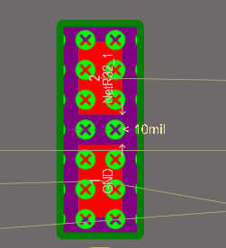

## 1. 常见绿色报错的处理方法
design -import 或者再原理图update 点击仅仅显示错误 然后不导入room
可以导出一个pdf的报告放在桌面上 然后一个一个改
将fanyilib拷贝到项目中 右键 添加文档到工程
从这个库里面找到缺失的footprint TO-92A

查错误的路线: 原理图-原理图库是否对应 再pcb中看封装是否正确
在pcb中搜索元件 j+c
在pcb中看管脚 是否与原理图对应
例: 封装缺失 封装管脚和原理图不对应

绿色报错:在pcb元器件上方的绿色叉叉

可以看到是小于10mil间距的报错
原因是规则的问题 工具-设计规则检查
把rules to check全部关闭, 只留下电器性能 把不需要的规则取消掉 
白色圆圈的器件= 短路 解决 拷贝了一遍仍然出错 考虑新建footprint 然后更新pcb 若仍然报错 则重新生成pcb

## 2. pcb板框大小评估
## 3. pcb快捷键的设置
## 4. 固定孔与器件的放置
## 5. pcb布局与布局优化