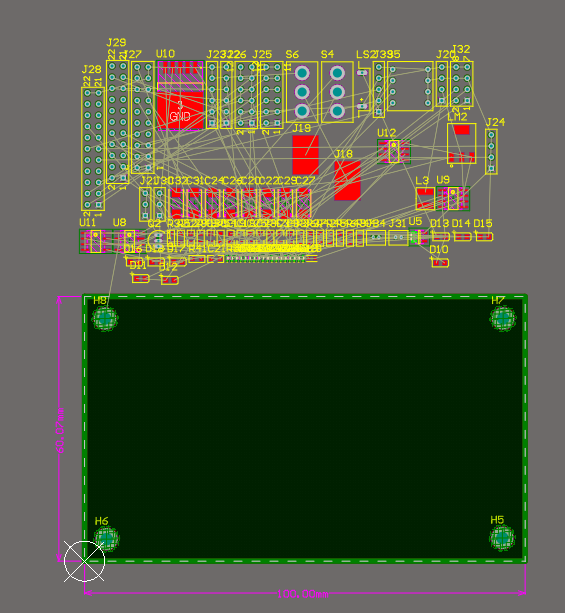

## 1. 常见绿色报错的处理方法
design -import 或者再原理图update 点击仅仅显示错误 然后不导入room
可以导出一个pdf的报告放在桌面上 然后一个一个改
将fanyilib拷贝到项目中 右键 添加文档到工程
从这个库里面找到缺失的footprint TO-92A

查错误的路线: 原理图-原理图库是否对应 再pcb中看封装是否正确
在pcb中搜索元件 j+c
在pcb中看管脚 是否与原理图对应
例: 封装缺失 封装管脚和原理图不对应

绿色报错:在pcb元器件上方的绿色叉叉

可以看到是小于10mil间距的报错
原因是规则的问题 工具-设计规则检查
右键 把rules to check全部关闭, 只留下电器性能 把不需要的规则取消掉  **按TM复位**
白色圆圈的器件= 短路 解决 拷贝了一遍仍然出错 考虑新建footprint 然后更新pcb 若仍然报错 则重新生成pcb

## 2. pcb板框大小评估与叠层设置
布局：tools-器件摆放 设置快捷键ctrl左键 设置
在机械层画线 外框 再按e o s设置左下角原点 edit origin set
板框的大小调整到整数 
可以在板框上标记一下尺寸 place 尺寸 tab键设置 mm 两位小数
重新定义板框 shift 选中所有板框 design borardShape d
固定孔放置 放到原点 然后xy各移动5mm 放在四个角落 
移动的时候要框选而不是点一下

叠层设置 四层的设计难度低 电源和地分两层 信号质量高  
TODO:层数判断的视频 

设计-层叠管理器 insert layer 
signal正片层
plane负片层 一整片铜皮 正片的线是铜 负片的线去铜
core芯板 绝缘材料
prepreg pp半固化片 基材 pcb中间的 硬板 影响阻抗特性
surface finish 表面处理 沉金 喷漆

右键添加两个负片层 改名 内层一GND02 内层二PWR03 保存 关闭
在GND02双击平面分割 连接到GND 画一个闭合的区域可以分割不同的网络
PWR03链接到3.3V  之后的元件可以通过 打孔链接 此时若连接到则在对应层内显示为一个×的孔 打孔的时候右边菜单栏选择网络类型

注意此时的元器件都没在板子内 从外面往里面拖进来

shitfS开单层显示

## 3. pcb快捷键的设置

按s选择 可以把线选和框选设置快捷键
shiftS 单层显示
shiftR 走线 忽略障碍物 切换的模式在设置 pcb editor -- interactive routing
shiftE 切换抓取
N      网络显示
S      选择
TD     执行DRC
DR     规则
DC     class
Q      单位切换
TTM    多跟走线

## 4. pcb布局与布局优化
工具 打开交叉选择模式  水平分割 在原理图选中模块 选择布局

隐藏电源网络： Design-classes
在net class创建PWR类 把V和GND都放进去
然后再右下角panels PCB 右键PWR类 隐藏
TC 交叉探针

布局的开始 ：先大后小 先画核心 没有核心先画插针

三个插针 右键 联合

布局的时候关闭所有飞线 N hide connection

改丝印的大小 右键丝印 选择相似 
designator same 选中所有丝印 然后 高度10mil
宽度2mil

然后选中所有器件 a 定位器件文本
把位号放在中心

高亮显示 pcb ctrl左键 原理图 alt左键

ctrl左键 高亮显示 配合shifts 最后shiftc取消
数字和模拟分开
电源芯片这边开始考虑 从电源芯片出来的GGND VCC分别高亮来看 分开放GGND和GND
两个大焊盘是电池供电 放在板子边缘